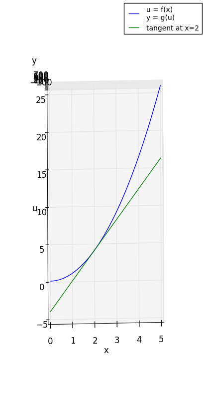

# visual_proof_of_chain_rule
A Visual Proof of Calculus Chain Rule Using Python with matplotlib

## Screenshots

### Projection on x-u plane

### Projection on u-y plane

### Projection on x-y plane

Some discuessions on the meaning of *dx*:

[Putting Differentials Back into Calculus](http://math.oregonstate.edu/bridge/papers/differentials.pdf)

[Extending the Algebraic Manipulability of Differentials](https://arxiv.org/pdf/1801.09553.pdf)

[微积分核心概念的无矛盾表述](https://www.google.com.hk/url?sa=t&rct=j&q=&esrc=s&source=web&cd=2&ved=0ahUKEwisrNe7q6XZAhUEUrwKHdNDBigQFggsMAE&url=http%3A%2F%2Fwww.escience.cn%2Fsystem%2Fdownload%2F80617&usg=AOvVaw18t0VxKvIe1B92MrvSnkZ6)

[Infinitesimals, Imaginaries, Ideals, and Fictions](https://arxiv.org/ftp/arxiv/papers/1304/1304.2137.pdf)
