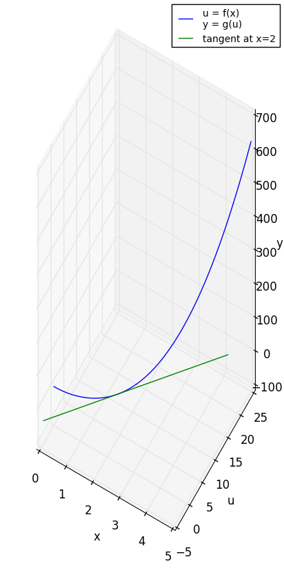

# visual_proof_of_chain_rule
A Visual Proof of Calculus Chain Rule Using Python with matplotlib

## Screenshots

### Projection on x-u plane

### Projection on u-y plane

### Projection on x-y plane

## Summary
The tangent of composite function is the composite of the tanget function of each function.

The projection of the tangent of the 3D curve is the tangent of the projection of the curve.

Adding of one more variable corresponds to adding of one more dimension.

## Some discuessions on the meaning of Differentials:

### What dx and dy are not:

     
(The first three fraction lines are not real fraction lines, they are part of the 1st and 2nd derivative operators.)

### Some existing explanations:
1. dx is infinitesimal of Δx or very tiny tiny Δx or a number who's absolute value is smaller then all positive real number but not equal to 0. (Somebody make this rigious by inventing standard analysis.)
2. Some define dy as linear approximation of Δy. It can be proved that dy = f'(x) Δx. Following this definition, dx = Δx. That means you have to define x as independent variable and y as dependent variable. That means linear approximation is the tangent line. The tangent line at a point on a curve is the same no matter you treat x or y as dependent variable. But people using this definition usually don't explicity indicate which variable is independent and just imply it by context. And furthermore they will define  = 0 as they define dx (=Δx) as constant. So that dy is dependent both on independent variable x and constant dx.
3. Some say they are symbolic(?).

### My explanation:
dx and dy can be defined as the 'Δx' and 'Δy' of the tangent line. dx is not necessarily equal to Δx, they are independent. dx and dy can take large value (but usually we are interested in the case when they take small value). This can be extended to multi variable function as dx, dy, dz... are the 'Δx', 'Δy', 'Δz'... of the linear approximation function. (e.g. for single variable function, the linear approximation function is the tangent line equation. For two variable function, it is the tangent plane equation.) In 1) dx and dy is treated as fundamental concept and slop as derived concept. Here slop is treated as fundamental concept and dx and dy as derived concept.

### References
[Putting Differentials Back into Calculus](http://math.oregonstate.edu/bridge/papers/differentials.pdf)

[Extending the Algebraic Manipulability of Differentials](https://arxiv.org/pdf/1801.09553.pdf)

[微积分核心概念的无矛盾表述](https://www.google.com.hk/url?sa=t&rct=j&q=&esrc=s&source=web&cd=2&ved=0ahUKEwisrNe7q6XZAhUEUrwKHdNDBigQFggsMAE&url=http%3A%2F%2Fwww.escience.cn%2Fsystem%2Fdownload%2F80617&usg=AOvVaw18t0VxKvIe1B92MrvSnkZ6)

[Infinitesimals, Imaginaries, Ideals, and Fictions](https://arxiv.org/ftp/arxiv/papers/1304/1304.2137.pdf)
